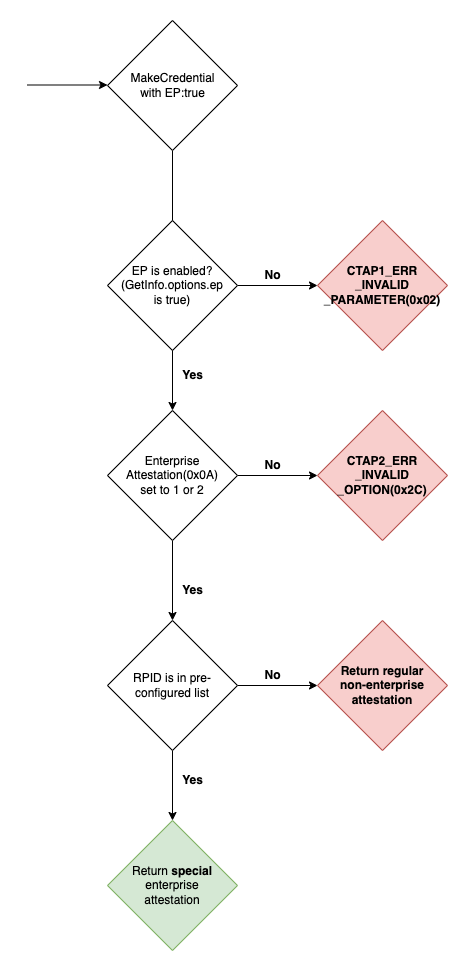

# Enterprise Attestation

Enterprise attestation is a feature that allows a custom attestation to be returned for the strict set of defined relying parties identifier. The attestation may include some identifiable information in the attestation. This feature is extremely useful for the enterprise entities, businesses, organisations that require much more tight control of the devices. 

The enterprise attestation, and list of allowed rpids is configured, burned in, by the manufacturer during production, and can not be changed after the fact by the vendor.

If enterprise attestation is requested by the relying party, who's rpid is not in the list of allowed rpids, it shall return normal, non-enterprise, attestation to preserve privacy.


## Feature detection

Authenticator advertises support for this extension by returning `ep` in the `GetInfo.options(0x04)`.

If enterprise attestation is enabled, `GetInfo.options.ep` shall be set to true. 

If it is disabled it `GetInfo.options.ep` shall be set to false.


## Authenticator Config and Reset

If authenticator supports AuthrConfig, it shall support `enableEnterpriseAttestation(0x01)` sub command.

During the reset, enterprise attestation must be disabled, and it can be re-enabled using the authenticator config.


## Create/MakeCredential

To get enterprise attestation the Platform will send MakeCredential with `enterpriseAttestation(0x0a)` field set to 1 or 2. Authenticator shall treat both 1 or 2 as equal.

```
MakeCredential_Request
{
    1: fe87bb84f9ee...,    // clientDataHash
    2: {...},              // rp
    3: {...},              // user
    4: [...],              // pubKeyCredParams
    5: [...],              // excludeList
    8: 51e971f093509e4..., // pinUvAuthParam
    9: 2,                  // pinUvAuthProtocol
    a: 1                   // enterpriseAttestation
}
```

If enterprise attestation is disabled(`GetInfo.options.ep` is false) then authenticator shall return `CTAP1_ERR_INVALID_PARAMETER(0x02)`


If authenticator receives `enterpriseAttestation(0x0a)` with any value but 1 or 2, the authenticator must return `CTAP2_ERR_INVALID_OPTION(0x2c)`.

On success, if all checks been passed, and the rpid is in allow list, then authenticator will return an enterprise packed attestation, with enterprise certificate, and signed by an enterprise private key. Additionally, in make credential result, device will add `epAtt(0x04)` field set to true.


For conformance testing, FIDO Alliance has it's own attestation requirements that can be found here: https://github.com/fido-alliance/conformance-test-tools-resources/tree/master/docs/FIDO2/Security-Key#enterprise-attestation

```
MakeCredential_Result
{
    1: "packed",             // fmt
    2: 9569088f1ecee32329... // authData
    3: {...},                // attStmt - packed attestation containing enterprise attestation
    5: true                  // epAtt
}
```

// TODO: Add EP example with FIDO Alliance key


## Diagram

